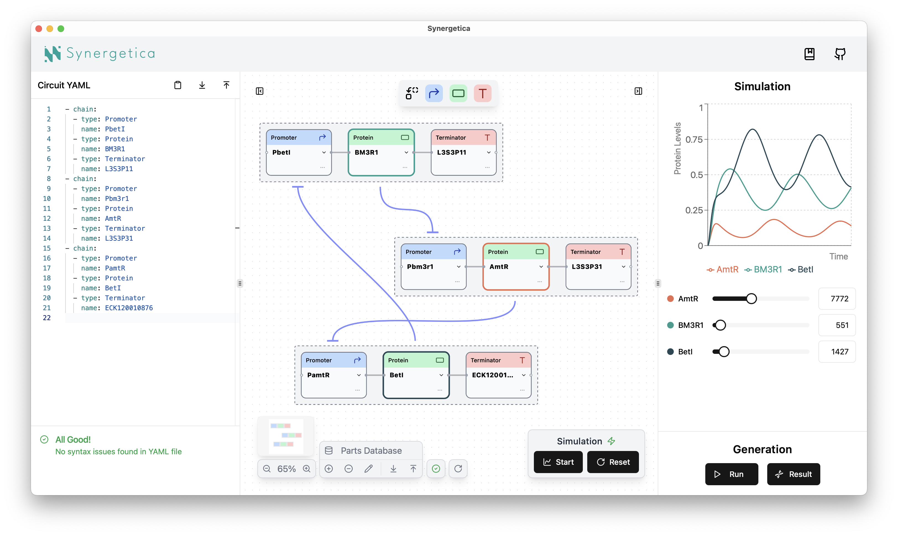

<h1>

  
</h1>
  

    A modern, end-to-end genetic circuit design desktop app
  

  

    
  

## What is Synergetica?

Synergetica is a powerful desktop application for genetic circuit design. It provides an end-to-end workflow that allows you to design circuits, run simulations, and generate DNA sequences—all within a single platform.

## Highlights

* 🧩 Design genetic circuits using either a node-based or code-based interface
* 🤖 Simulate protein expression levels for your circuits interactively
* 🧬 Generate DNA sequences based on parameters determined through simulation
* ⚙️ Customize your circuits by adding genetic parts that suit your needs
* 🔌 Work entirely offline, ensuring complete control and privacy

## Documentation

See the [documentation](https://khokao.github.io/synergetica/) on the Synergetica website.

## Authors

This project is developed by the following contributors (unordered):
* [@khokao](https://github.com/khokao)
* [@ok09ra](https://github.com/ok09ra)
* [@Thickstem](https://github.com/Thickstem)

## License

This code repository is licensed under [the MIT License](LICENSE).
