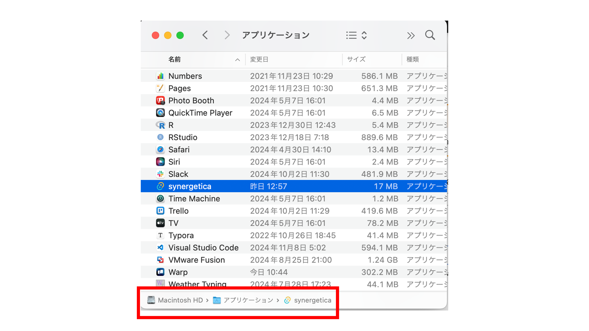
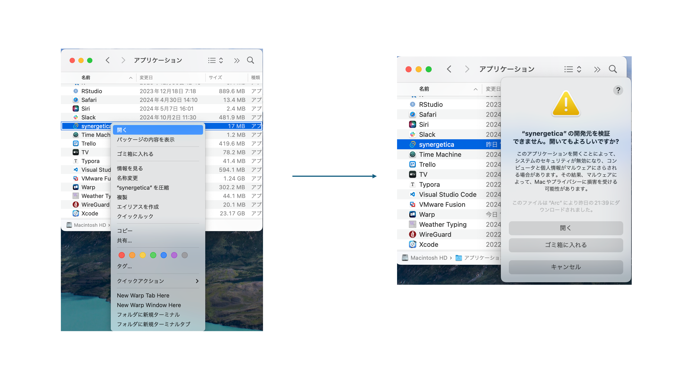

To use synergetica, you have to install both materials, `Backend docker images` and `Desktop app`

## Backend docker image

1. Login to docker hub. (If you already logged in, you can skip.)

2. Pull the docker image with this command.

```console
docker pull khokao/synergetica
```


## Desktop app

Install desktop app of synergetica. Choose the appropriate guide for your operating system.

=== "macOS"

    Setup on Mac
    !!! warning
        Since synergetics has not obtained a certificate from APPLE, it cannot be opened without following these steps.

    1. Download appropriate installer for your architecture and install.
       [Download link](https://drive.google.com/drive/folders/1YUu2UI_ASRp4eGSrJu7tiib_UGKfV9hT?usp=sharing)
    

    2. Find installed synergetica app from `Macintoch HD/application` page of your finder.
    


    3. Right-click and select Open. A warning will be displayed, but still click open.
    
    　

    4. App will launch. Once opened in this way, it can be opened by simply double-clicking the icon from desktop.


=== "Windows"

    Setup on Windows

    1. foo
    2. bar


