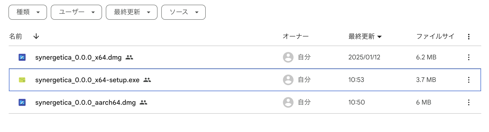

To use Synergetica, you have to install both **Backend docker images** and **Desktop app**

## Backend docker image

1. Login to docker hub. (If you already logged in, you can skip.)
```console
docker login -u <USER_NAME> -p <PASSWORD>
```

2. Pull the docker image with this command.
```console
docker pull khokao/Synergetica
```


## Desktop app

Install desktop app of Synergetica. Choose the appropriate guide for your operating system.

=== "macOS"
    Setup on Mac

    !!! warning
        Since synergetics has not been notarized by Apple, it cannot be opened without following the steps below.

    !!! Tip
         Once opened in this way, you can then simply launch it by double-clicking its icon on the desktop.

    1. Download appropriate installer for your architecture and install it.
       <u>[Download link](https://drive.google.com/drive/folders/1YUu2UI_ASRp4eGSrJu7tiib_UGKfV9hT?usp=sharing)</u>
    


    2. In the terminal, run the following command to delete extended attribute of the app file.
    ```sh
    xattr -d com.apple.quarantine /Applications/Synergetica.app
    ```

    3. Double click the icon of synergetics, after a few seconds, when you see popup saying
    `Connected to server`, the application will be ready to use.
    


=== "Windows"

    Setup on Windows

    1. foo
    2. bar
