This tutorial demonstrates the entire workflow for a simple **toggle switch** circuit.

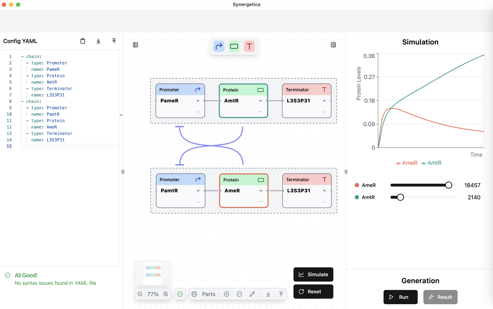

You will learn how to:

- **Design** a circuit using both node-based and code-based methods.
- **Simulate** the circuit and adjust parameters.
- **Generate** DNA sequences that match your desired parameters and export them.

## 1. Designing a circuit

### Build a single chain
First, we'll build a single **chain**, a sequence of blocks.

#### Drag and drop blocks

At the top of the application window, you will see a palette containing various colored blocks. Drag a <span style="color: blue">blue block</span> (promoter) and drop it onto the main area.

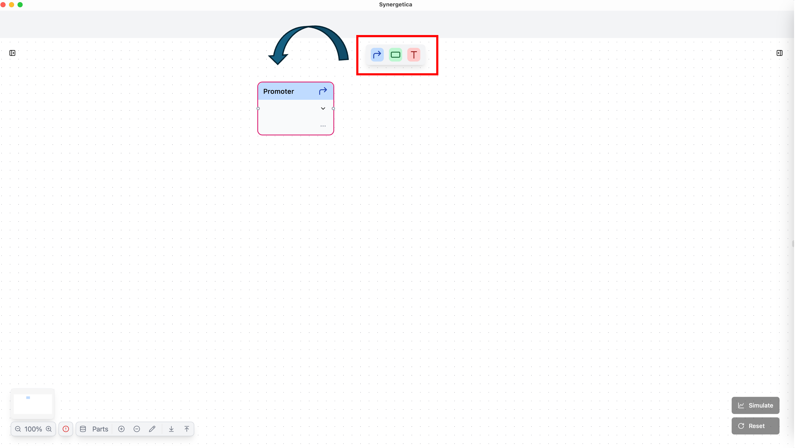

!!! tip
    See the <u>[guide on circuit design](../guides/circuit-design.md)</u> to understand in more detail what each block means.

#### Select a part

Click the newly placed blue block to open a selection panel where you can assign a specific biological part. For this tutorial, choose <span style="color: blue">"PameR"</span>.

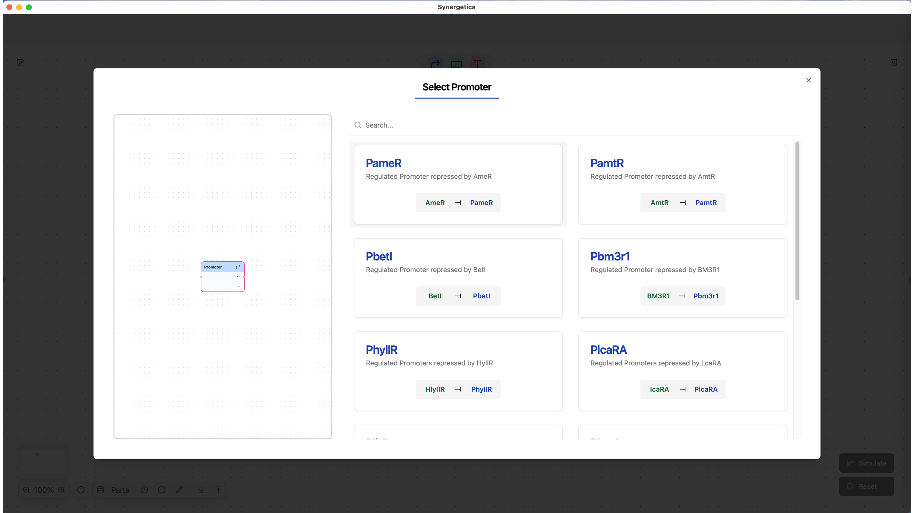

#### Connect more blocks

When you drag a new block and bring it near an already existing block, the blocks will automatically connect to each other.

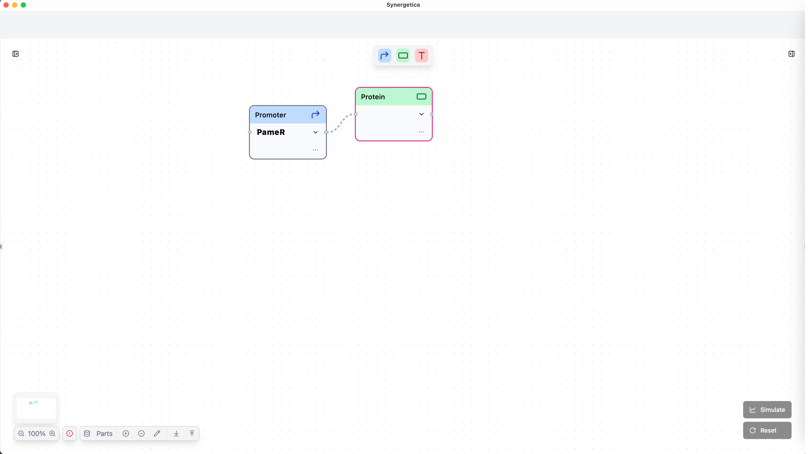

- Drag a <span style="color: green">green block</span> (protein) near the <span style="color: blue">blue block</span> and drop it to connect them.
- Drag a <span style="color: red">red block</span> (terminator) near the <span style="color: green">green block</span> and drop it to connect them.
- Select <span style="color: green">"AmtR"</span> as the part for the <span style="color: green">green block</span> and <span style="color: red">"L3S3P31"</span> for the <span style="color: red">red block</span>.

You have now created a single **chain** of three blocks: a promoter, a protein, and a terminator.

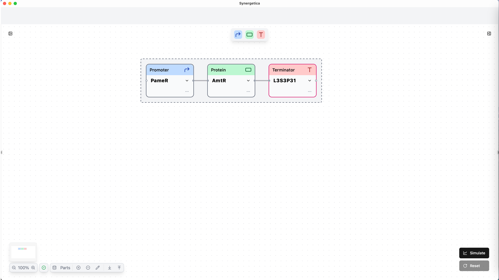

!!! note
    A **"chain"** is a sequence of <span style="color: blue">promoters</span>, <span style="color: green">proteins</span>, and a <span style="color: red">terminator</span>.

### Build another chain with DSL

Circuits can also be designed using the Synergetica **DSL**.

The DSL editor is accessible by clicking the sidebar toggle on the left side of the application.

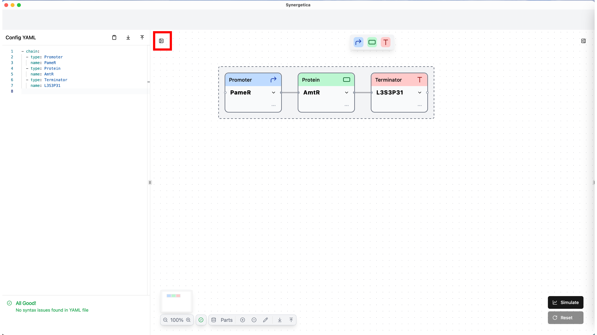

#### Check existing code

The following code should already be present in the coding palette. It represents the chain that was just constructed.

```yaml title="Circuit YAML"
- chain:
  - type: Promoter
    name: PameR
  - type: Protein
    name: AmtR
  - type: Terminator
    name: L3S3P31
```

!!! note
  	The node-based editor and the code-based editor are always synchronized.

#### Copy and paste

Copy the code of the existing chain and paste it immediately afterward. The same chain will then appear in the graphical view.

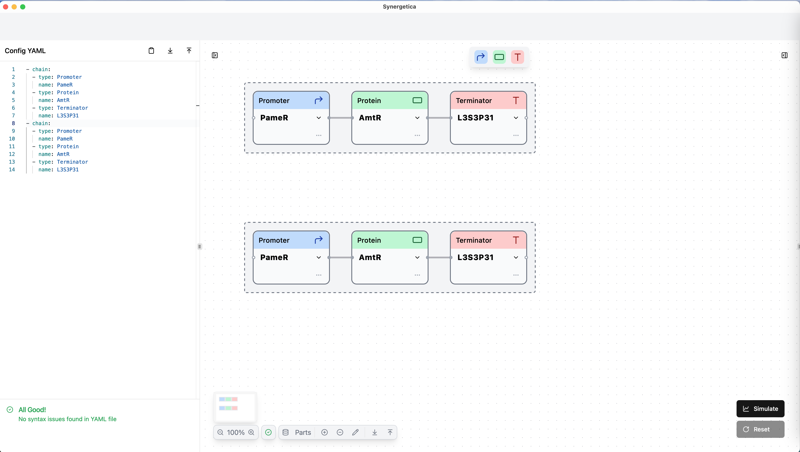

#### Rename parts

Change the names of two parts from <span style="color: blue">"PameR"</span> to <span style="color: blue">"PamtR"</span> and from <span style="color: green">"AmtR"</span> to <span style="color: green">"AmeR"</span> (see highlighted lines below):

```yaml hl_lines="10 12" title="Circuit YAML"
- chain:
  - type: Promoter
    name: PameR
  - type: Protein
    name: AmtR
  - type: Terminator
    name: L3S3P31
- chain:
  - type: Promoter
    name: PamtR
  - type: Protein
    name: AmeR
  - type: Terminator
    name: L3S3P31
```

After that, the blocks in the graphical view will automatically update, and blue arrows will appear to indicate the interactions between the blocks.

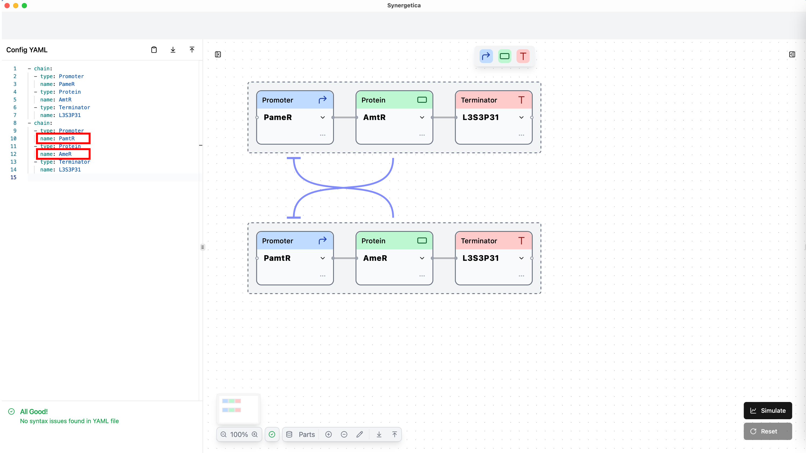

You have now finished building the toggle switch circuit! :raised_hands:

!!! note
  	If there is an interaction between a promoter and a protein in the circuit, an arrow will automatically appear to illustrate that interaction. The arrow starts at the protein and ends at the promoter.

    - :fontawesome-solid-arrow-up:{ .activation }: **Activation** (the protein increases the expression of the connected promoter)
    - :fontawesome-solid-t:{ .repression }: **Repression** (the protein decreases the expression of the connected promoter)

    In the part selection screen, you can see which parts interact with each other.

## 2. Running a simulation

With your toggle switch circuit in place, it’s time to see how it behaves over time.

### Click the "Start" button

To start the simulation, click the **"Start"** button in the lower right corner of the application. This will automatically open the simulation sidebar from the right side and display the results.

The graph shows how the protein (green block) concentration changes over time in this circuit.

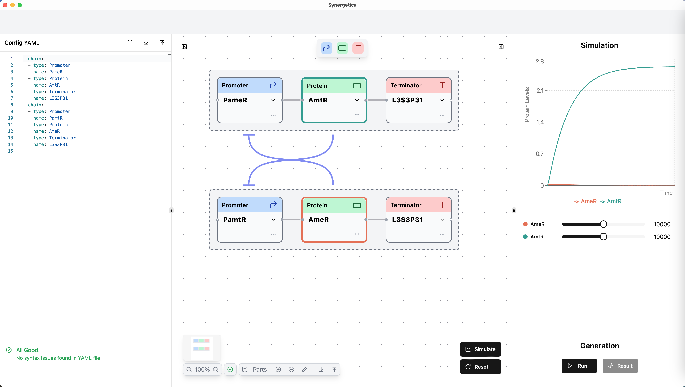

!!! tip
  	See the <u>[guide on genetic simulation](../guides/genetic-simulation.md)</u> to know more about what the graphs and slider values mean biologically.

### Adjust parameters

Two sliders are displayed, each corresponding to a protein in the circuit and allowing you to adjust the translation intensity.

Try moving each slider and notice that adjusting one slider affects both curves.

Adjust the parameters to achieve the protein concentration you desire.

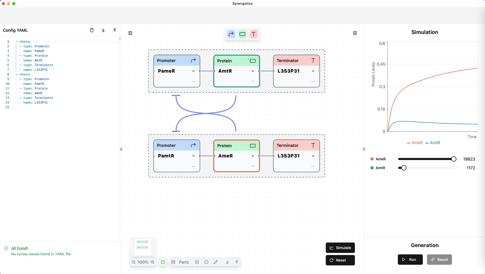

## 3. Generating sequences

Once the parameters have been adjusted, the last step is to generate the specific DNA sequences to realize your chosen parameters.

### Start sequence generation

Click the **"Run"** button in the Generation section at the bottom right of the app to start the sequence generation process.

Synergetica will create optimized DNA sequences corresponding to the circuit parameters you set.

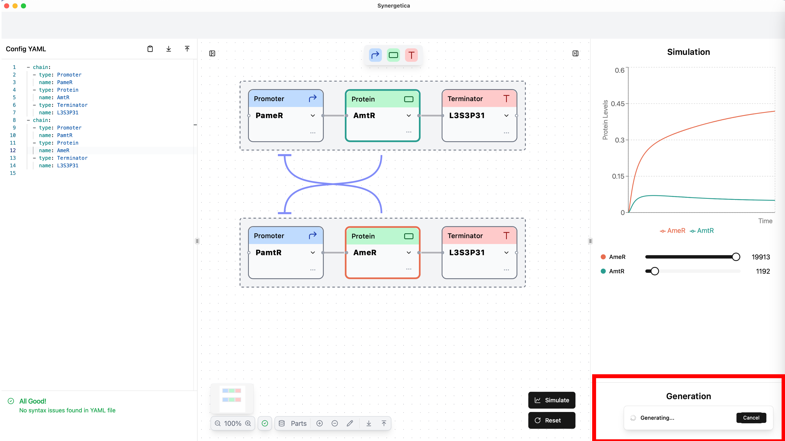

### View the results

Once generation completes, you can view the results by clicking the **"Result"** button.

The generated DNA sequences corresponding to each **chain** will be displayed in the result window.

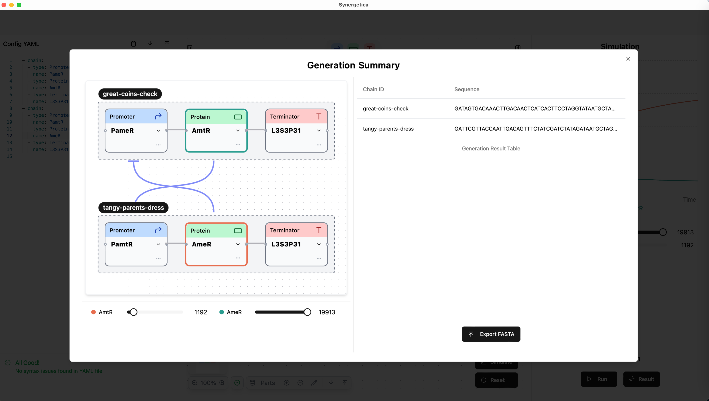

!!! tip
    See the <u>[guide on sequence generation](../guides/sequence-generation.md)</u> to understand the generation process in more detail.

### Export to FASTA

By clicking the **"Export FASTA"** button, you can save these sequences locally in FASTA format.

``` fasta title="Example FASTA"
> great-coins-check
GATAGTGACAAACTTGACAACTCATCACTTCCTAGGTATAATGCTAGCCAGCGTGTGTTCCGGGGCCACTTGTTACTGCCCAATTATTGAACACCCTAACGGGTGTTTTTTTTTTTTTGGTCTACC

> tangy-parents-dress
GATTCGTTACCAATTGACAGTTTCTATCGATCTATAGATAATGCTAGCGTGCCGACTCGATGGAATGTACCATTGGCCCCCAATTATTGAACACCCTAACGGGTGTTTTTTTTTTTTTGGTCTACC
```

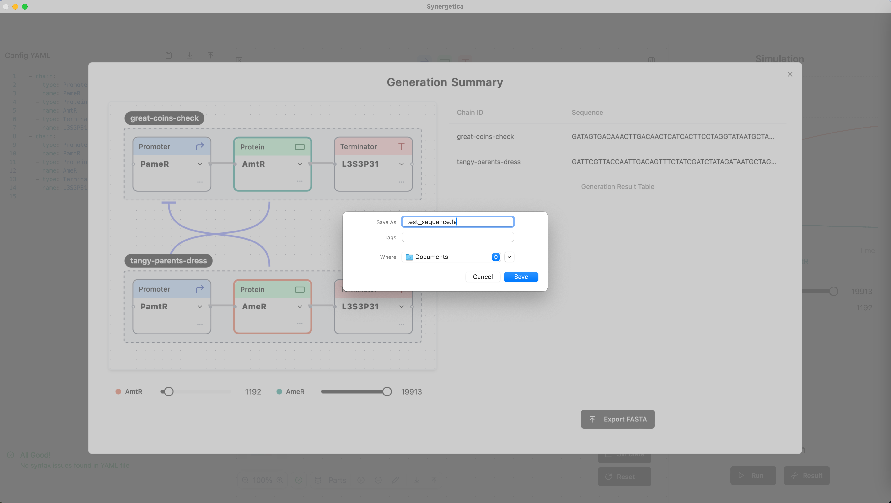

---

**Congratulations!**

You’ve successfully designed, simulated, and generated sequences for a toggle switch using Synergetica. If you’d like to learn more, check out the Guides section.

Happy designing!
