This page explains how to create a genetic circuit with Synergetica.

## Block types

{ align=left width="200" }

### Promoter
A promoter controls the timing and strength of transcription for the downstream DNA sequence. Specific proteins can bind to it to either activate or repress transcription.

<div style="clear: both;"></div>

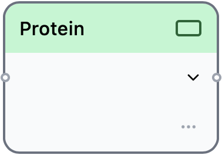{ align=left width="200" }

### Protein

A protein is a functional molecule produced within a cell. In living organisms, proteins are essential components in various biological processes.

<div style="clear: both;"></div>

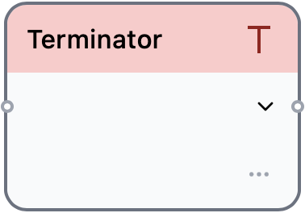{ align=left width="200" }

### Terminator

A terminator marks the end of transcription and also plays a role in regulating the degradation rate of the resulting transcript.

<div style="clear: both;"></div>

!!! info
	When multiple identical terminators are present, homologous recombination may occur, potentially altering the DNA sequence. To prevent this, Synergetica offers multiple terminator variants.

## Building circuits

### Method 1: Node-based design

Design a circuit using the graphical interface.

#### Placing a block

Drag any block from the block placement area at the top of the window and drop it onto the main area.

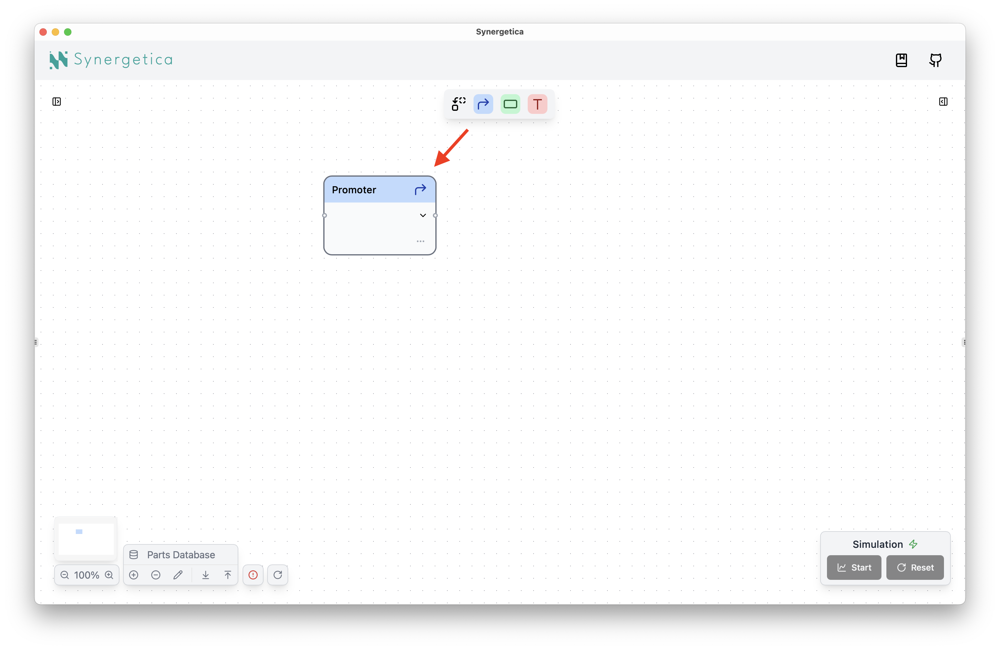

#### Deleting a block

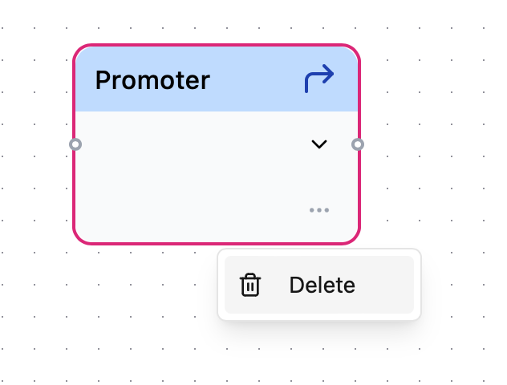{ align=right width="300" }

There are two ways to delete a block.

1. Select the block and press the ++backspace++ key.
2. Click the "**:material-dots-horizontal:**" button and select **"Delete"**.

<div style="clear: both"></div>

#### Connecting blocks

When you drag a new block near an existing one, they will automatically connect.

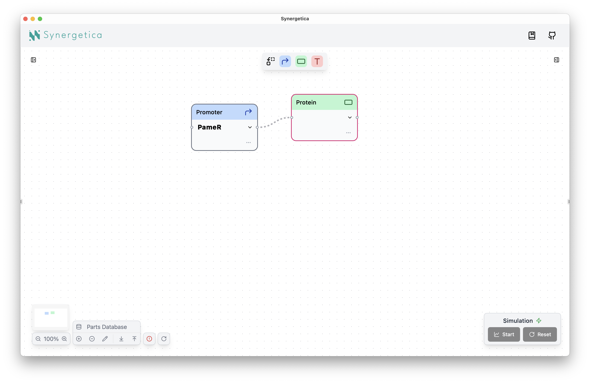

!!! note
	In Synergetica, this connected unit of blocks is called a **chain**.

#### Disconnecting blocks

When you hover the mouse cursor over the edge between blocks, an :octicons-x-circle-16: button will appear. Clicking this button disconnects the blocks.

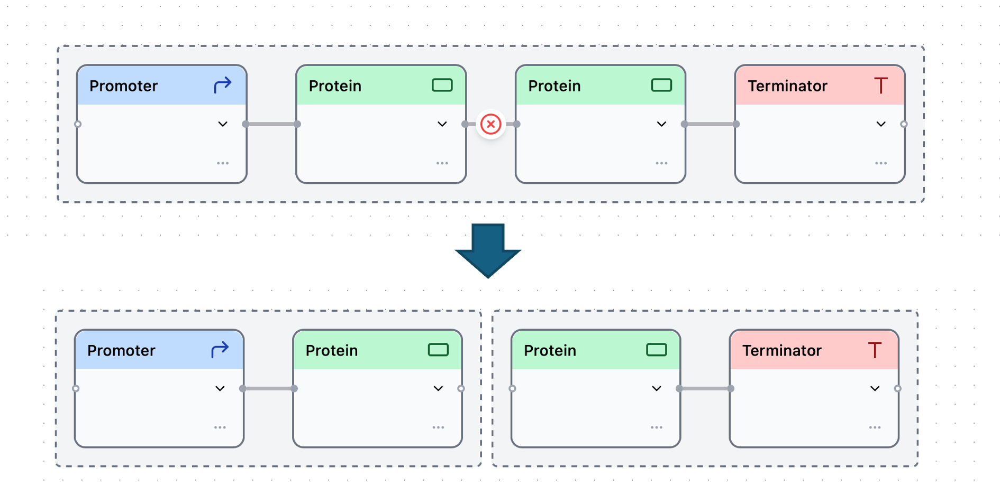

Alternatively, you can also drag the block away from the chain to disconnect it.

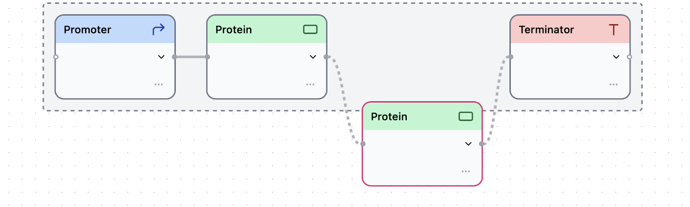

### Method 2: Code-based design

Circuits can also be designed using the Synergetica DSL, a custom domain-specific language developed exclusively for genetic circuit design.

#### Basic structure of the Synergetica DSL

- The code is written in YAML format.
- It is defined as an array of objects, each with a single key: `chain`.
- Each `chain` is an array of elements, where each element contains:
	- `type`: the block type (`Promoter`, `Protein`, or `Terminator`)
	- `name`: the part name

``` yaml title="Example YAML"
- chain:
  - type: Promoter
    name: PamtR
  - type: Protein
    name: BM3R1
  - type: Terminator
    name: L3S3P31
- chain:
  - type: Promoter
    name: Pbm3r1
  - type: Protein
    name: AmtR
  - type: Terminator
    name: L3S3P11
```

!!! tip
	Because the node-based editor and the code-based editor are always synchronized, you can switch between them at any time.

!!! info
	When the YAML-based circuit is loaded into the node-based editor, each chain is arranged vertically, and the blocks in each chain are arranged from left to right.

{ align=right width="350"}

#### Importing and exporting YAML files

To import or export a YAML file, click the :material-arrow-collapse-down: and :material-arrow-collapse-up: buttons located in the top bar of the code palette.

<div style="clear: both"></div>

!!! tip
	You can save and share your circuit using a YAML file.

## Completing valid circuits

Circuits are automatically validated for biological correctness. The validation results are displayed at the bottom of the code palette, and an icon indicating the result is shown in the node-based editor.

**Valid**
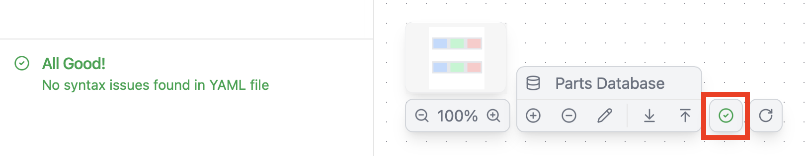

**Invalid**
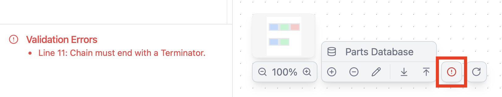

!!! Warning
	If the designed circuit is invalid, you cannot run a simulation.

Here are the basic rules for a valid circuit.

- **Chain rule**: A chain must consist of one or more promoters, followed by one or more proteins, and end with exactly one terminator.
- **Block rule**: The part name must be included in the list of parts for each block type.

??? Success "Valid circuit examples"

	- **Minimum valid circuit**
	

	- **Multiple proteins are allowed**
	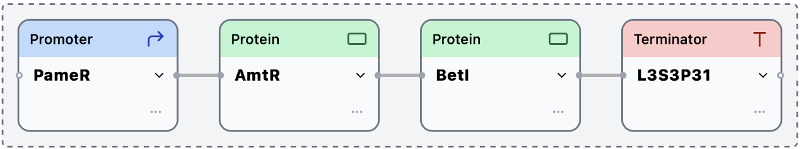

	- **Multiple promoters are allowed**
	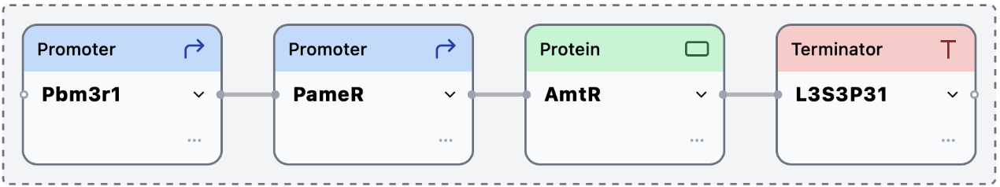

??? Failure "Invalid circuit examples"

	- **A chain must start with promoter(s)**
	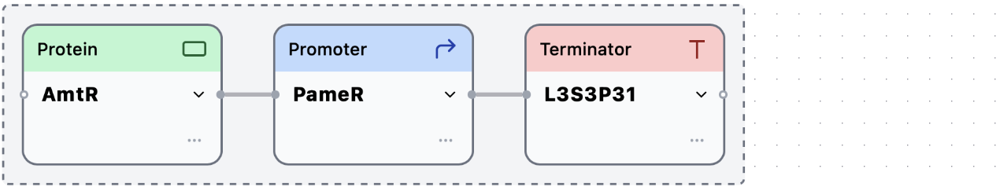

	- **Protein(s) must follow promoter(s) before a terminator**
	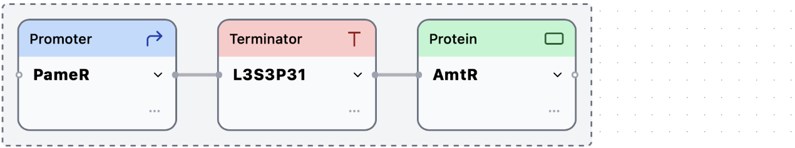

	- **Empty blocks are not allowed**
	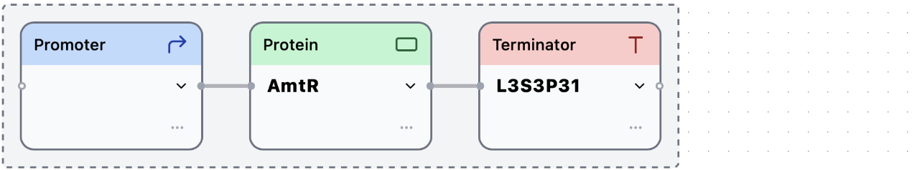

	- **Protein(s) must follow promoter(s) before a terminator**
	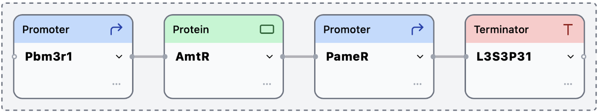
