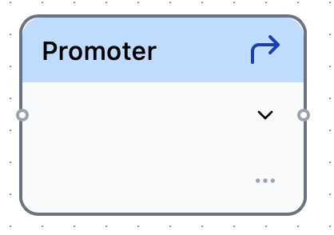
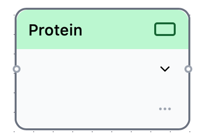
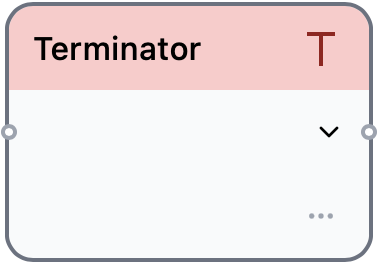
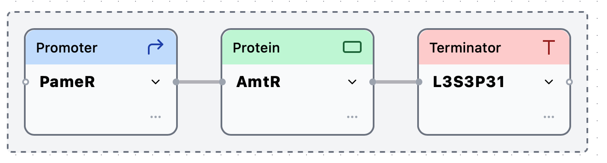
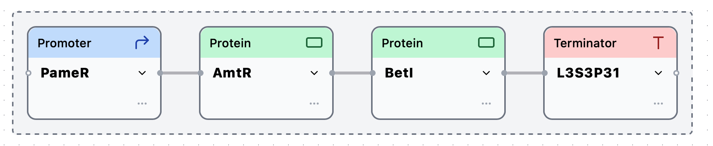
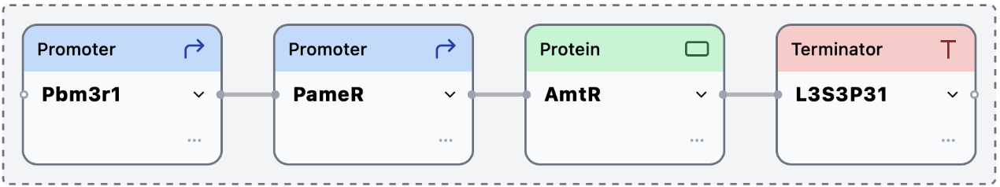
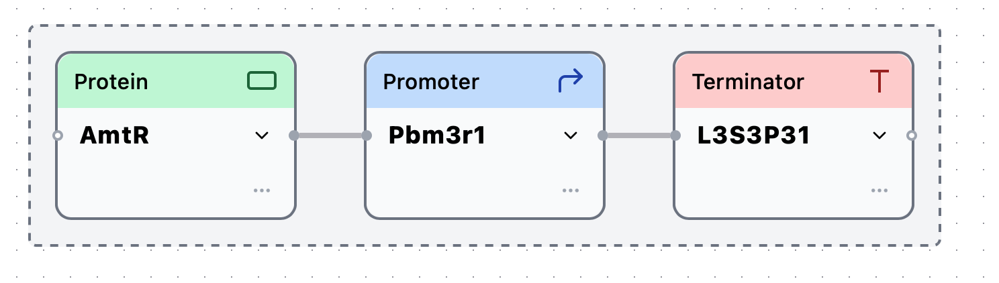
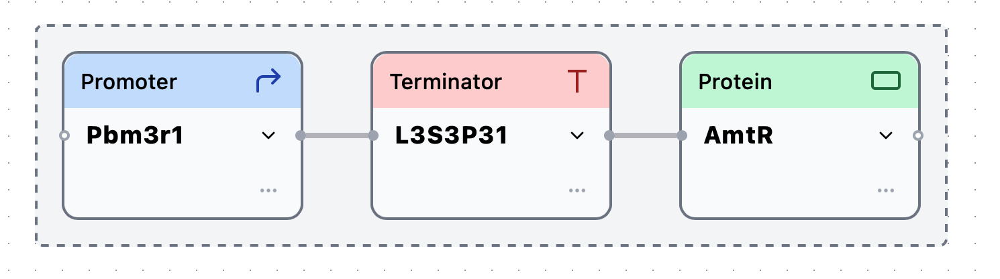
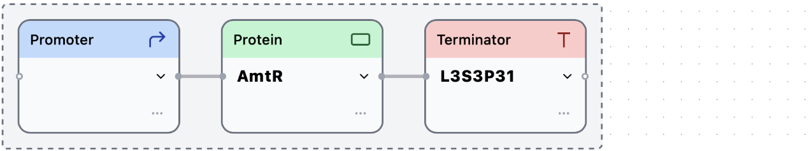
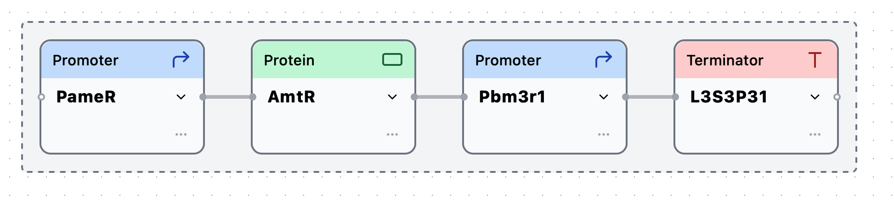

## Building circuits

Here, you can learn more about how to create a genetic circuit using Synergetica.

### Block types

**Promoter**: The promoter part controls the timing and strength of transcription for the downstream DNA sequence. Specific proteins can bind to the promoter to either activate or repress transcription.

{ width="200" height="150"}


**Protein**: The protein part represents a protein that is actually produced within a cell. In living organisms, proteins serve as the functional entities responsible for various biological processes.

{ width="200" height="150"}

**Terminator**: A terminator is a part that indicates the end of transcription. It also plays a role in regulating the degradation rate of the DNA strand. If the same terminator part is used multiple times, a phenomenon called homologous recombination may occur, potentially altering the DNA sequence. To prevent this, Synergetica provides multiple terminator parts.

{ width="200" height="150"}

*For detailed explanations of each part in each block type, please refer to <u>[this page]()</u>.

### Method 1: Arranging blocks

Designing a circuit with the GUI

**Placing block**

- You can place any block by dragging it from the block placement area at the top of the application and dropping it onto the main area.


**Delete block**

- There are two ways to delete a block.

A. Select the block and press the `DELETE` key.

B. Click the overflow menu button and select `Delete`.

{ width="300" height="200" }


**Connect blocks**

- When you drag a new block and bring it near an already existing block, the blocks will automatically connect to each other.


!!! Info
	In Synergetica, this connected unit of blocks is called a **chain**.

**Disconnect blocks**

- When you place the mouse cursor on the edge between blocks, an "×" button will appear. Clicking this button will allow you to separate the blocks.

{ width="500" height="350 " }

- Alternatively, you can disconnect by dragging the part from the chain beyond a certain distance.

{ width="500" height="350"}


### Method 2: Defining YAML configurations

Circuit can be designed through coding with DSL.

**Basic Structure of DSL**

- The components of a genetic circuit have to be defined within the `chain` array. Each element has a `type` (type of block) and a `name` (parts name).

- As the elements (`type` and `name`) described in YAML from top to bottom, the blocks will be connected **from left to right**

```yaml
- chain:
    - type: Promoter
      name: PameR
    - type: Protein
      name: AmeR
    - type: Terminator
      name: L3S3P31
```

**Import & Export YAML file**

- Synergetica can import & export the YAML configurations by clicking highlighted buttons in the below image.

!!! Success
	So you can **save and share your project** through YAML file.

{ width="500" height="350"}

!!! Tips
	The graphical design with blocks and the DSL are always synchronized, allowing you to alternate between design methods at any time.


## Completing valid circuits

- In Synergetica, designed circuits are automatically checked to ensure they are biologically valid.
- Validation results are showed in the bottom of DSL pallet and the icon highlighted in the below image.

**Valid**


**Invalid**


!!! Warning
	If the desinged circuit is invalid, `Simulation` can't be conducted. 

Here are basical rules of valid circuit.

**Rule of Blocks**

- `type` and `name` are not missed.
- Value of `type` is included in [`Promoter`,`Protein`,`Terminator`]
- Value of `name` is included in the parts list of each block type (<u>[See here for detail]()</u>)

**Rule of Chains**

- Chain must start with Promoter(s)
- A promoter cannot appear after Proteins.
- After Promoter(s), at least one Protein must follow before a Terminator.",
- No elements are allowed after the Terminator.(Chain must end with a Terminator)

??? Success "Valid circuit examples"

	- Minimum valid circuit.

	{ width="550" height="350" }

	- Multiple Protein is allowed.

	

	- Multiple Promoter is allowed

	

??? Failure "Invalid circuit examples"

	- Chain must start with Promoter(s)
	{ width="550" height="350" }

	- No elements are allowed after the Terminator.(Chain must end with a Terminator)
	{ width="550" height="350" }

	- Empty block is not allowed.
	{ width="550" height="350" }

	- A promoter cannot appear after Proteins.
	


