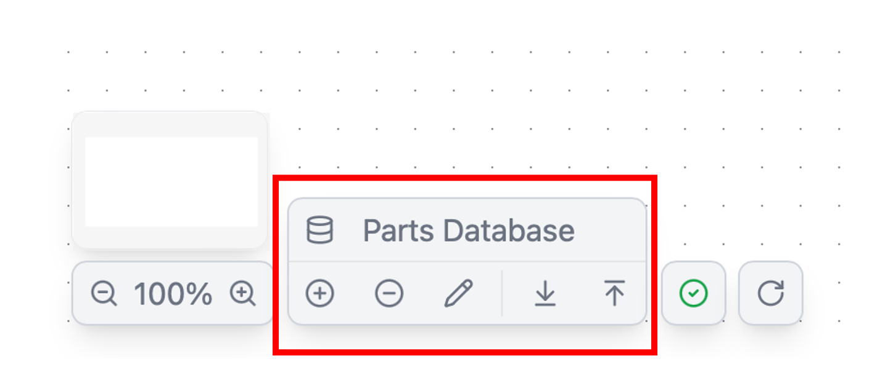
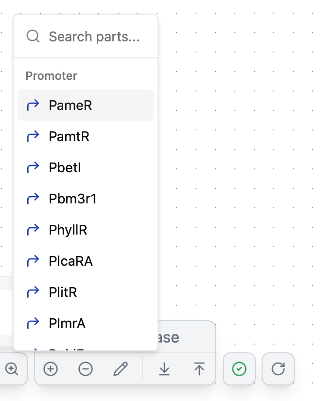
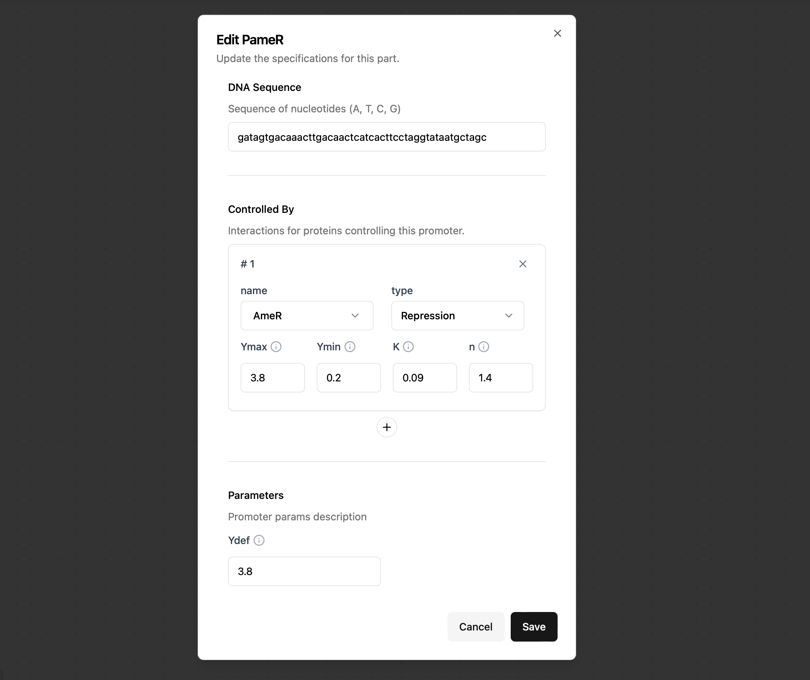

# Customizing parts

This section describes about the customization of parts.

You can customize parts from this area.




## Add parts

You can add any part by cliking `+` button and entering the required parameters.

### Common parameters

- **Name**(required): Parts name to add. This name have to be **unique** within the entire set of parts database.

- **Description** : Description of parts to add.

- **Parts Category**(required): Category of parts to add. Select from candidates.

- **DNA sequence**(required) : DNA sequence of parts to add. DNA sequence must consist only of A, T, G, and C.

Different types of parameters are required for each parts category(= block type).

### Parameters for Promoter

- **Ydef**(required): Expression strength of the gate in the absence of transcriptional regulators [RPU], i.e., if it is a repressive promoter, the value is the same as Ymax, and if it is an activation promoter, the value is the same as Ymin.

*If the added promoter interacts with some proteins, following parameters are also needed in `Control By` section.
 
- **Name**(required): Name of protein parts to interact. This parts have to be already exist in parts database.
- **Type**(required): Type of interaction between the promoter and the protein. `Repression` or `Activation`.
- **Ymax** :  Maximum expression rate of the gate[RPU].
- **Ymin** :  Minimum expression rate of the gate[RPU]. This means that leakage expression.
- **K** :  Michaelis-Menten constant, i.e., the protein expression level at which the expression level of the gate is halved [RPU].
- **n** :  Hill coefficient of the gate.

### Parameters for Protein

- **Dp**(required):  Protein degradation rate [RPU]. The default part values ​​are theoretical values ​​calculated from the steady state when the gate expression level is at its maximum, but it is recommended to use the actual measured value.

- **TIRb**(required):  Translation Initiation Rate in baseline experiments to determine the parameters. The Translation Initiation Rate represents the RBS strength. (For details on the Translation Inistiation Rate, see <u>[H. M. Salis, C. A. Voigt, Nat. Biotech. 2009](https://www.nature.com/articles/nbt.1568>)</u>)


!!! Warning
	To save added parts, you have to export parts database following the description in <u>[Import & Export parts](#import-export-parts)</u> section 

## Delete parts

- You can delete any part by cliking `-` button and select the part.

{width="300", height="150"}

## Edit parts

You can also edit the parameters of existing parts.

- By clicking 🖊️ buttton, the existing parts list appears and select the parts you want to edit.

- After changing the desired parameters, press the `Save` button.




## Import & Export parts

- The parts database can also be imported and exported by clickling below highlighted buttons.

{width="400",height="200"}

- When export, all parts in the database will be listed up in a `json` file .

```json
{
  "PameR": {
    "name": "PameR",
    "description": "Regulated Promoter repressed by AmeR",
    "category": "Promoter",
    "sequence": "gatagtgacaaacttgacaactcatcacttcctaggtataatgctagc",
    "controlBy": [
      {
        "name": "AmeR",
        "type": "Repression",
        "params": {
          "Ymax": 3.8,
          "Ymin": 0.2,
          "K": 0.09,
          "n": 1.4
        }
      }
    ],
    "params": {
      "Ydef": 3.8
    }
  },
  "PamtR": {
    "name": "PamtR",
    "description": "Regulated Promoter repressed by AmtR",
    "category": "Promoter",
    "sequence": "gattcgttaccaattgacagtttctatcgatctatagataatgctagc",
    "controlBy": [
      {
        "name": "AmtR",
        "type": "Repression",
        "params": {
          "Ymax": 3.8,
          "Ymin": 0.08,
          "K": 0.07,
          "n": 1.6
        }
      }
    ],
    "params": {
      "Ydef": 3.8
    }
  },
 .....
 "BM3R1": {
    "name": "BM3R1",
    "description": "Repressor Protein of Pbm3R1",
    "category": "Protein",
    "sequence": "atggaaagcaccccgaccaaacagaaagcaatttttagcgcaagcctgctgctgtttgcagaacgtggttttgatgcaaccaccatgccgatgattgcagaaaatgcaaaagttggtgcaggcaccatttatcgctatttcaaaaacaaagaaagcctggtgaacgaactgtttcagcagcatgttaatgaatttctgcagtgtattgaaagcggtctggcaaatgaacgtgatggttatcgtgatggctttcatcacatttttgaaggtatggtgacctttaccaaaaatcatccgcgtgcactgggttttatcaaaacccatagccagggcacctttctgaccgaagaaagccgtctggcatatcagaaactggttgaatttgtgtgcaccttttttcgtgaaggtcagaaacagggtgtgattcgtaatctgccggaaaatgcactgattgcaattctgtttggcagctttatggaagtgtatgaaatgatcgagaacgattatctgagcctgaccgatgaactgctgaccggtgttgaagaaagcctgtgggcagcactgagccgtcagagctaa",
    "controlBy": [],
    "params": {
      "Dp": 0.14726881,
      "TIRb": 596.23
    }
  },
}
```

- You can also add parts by appending necessary informaion to the JSON file and import it.

```json
{
"TestPromoter1": {
    "name": "TestPromoter1",
    "description": "Regulated Promoter repressed by TestProt1",
    "category": "Promoter",
    "sequence": "gattcgttaccaattgacagtttctatcgatctatagataatgctagc",
    "controlBy": [
      {
        "name": "TestProt1",
        "type": "Repression",
        "params": {
          "Ymax": 3.8,
          "Ymin": 0.08,
          "K": 0.07,
          "n": 1.6
        }
      }
    ],
    "params": {
      "Ydef": 3.8
    }
  },
 .....
 "TestProt1": {
    "name": "TestProt1",
    "description": "Repressor Protein of TestPromoter1",
    "category": "Protein",
    "sequence": "atggaaagcaccccgaccaaacagaaagcaatttttagcgcaagcctgctgctgtttgcagaacgtggttttgatgcaaccaccatgccgatgattgcagaaaatgcaaaagttggtgcaggcaccatttatcgctatttcaaaaacaaagaaagcctggtgaacgaactgtttcagcagcatgttaatgaatttctgcagtgtattgaaagcggtctggcaaatgaacgtgatggttatcgtgatggctttcatcacatttttgaaggtatggtgacctttaccaaaaatcatccgcgtgcactgggttttatcaaaacccatagccagggcacctttctgaccgaagaaagccgtctggcatatcagaaactggttgaatttgtgtgcaccttttttcgtgaaggtcagaaacagggtgtgattcgtaatctgccggaaaatgcactgattgcaattctgtttggcagctttatggaagtgtatgaaatgatcgagaacgattatctgagcctgaccgatgaactgctgaccggtgttgaagaaagcctgtgggcagcactgagccgtcagagctaa",
    "controlBy": [],
    "params": {
      "Dp": 0.14726881,
      "TIRb": 596.23
    }
  },
}
```

