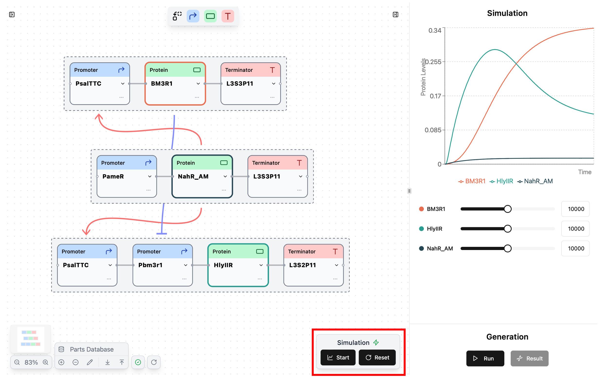
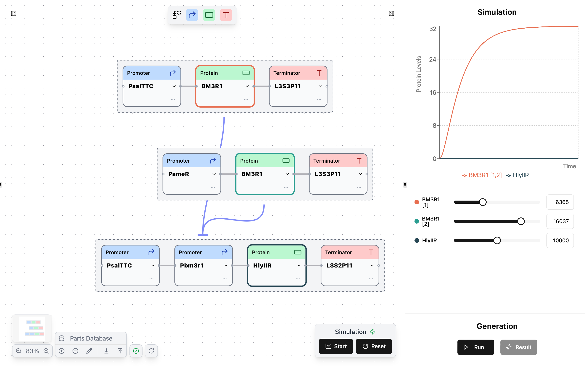

## Starting simulations

- After designed your desired circuit, you can simulate it by clicking **"Start"** button in the Simulation section.
- If the simulation is successful, the right side tab will open and the simulation results section will be displayed.
- You can reset simulation by clicking  **"Reset"** button.

 

!!! info "Info (Cirtcuit validtion)"
	If the designed circuit is invalid, you can't click **"Start"** button. please check [<u>this page</u>](./circuit-design.md#completing-valid-circuits) for about circuit validation.

!!! info "Info (API connection)"
    Check the :lucide-zap: icon at the simulation section to confirm that you’re connected to the backend API. If not connected, you can't click **"Start"** button.

    - :lucide-zap:{ .zap-on } : Connected to the API
    - :lucide-zap-off:{ .zap-off } : Not connected to the API

## Adjusting parameters

- In the simulation result section, parameter bars corresponding to each protein nodes appear.
- Sliding the parameter bar immediately updates the simulation results for that parameter.
- Parameter values can also be changed by entering directly to the value box.

!!! Note
	The parameter range is fixed at 1-20,000 for all parts, so if the entered value was over 20,000, it will automatically be modified to 20,000.

??? Tip  "Tip (When multiple protein nodes with the same name)"
	- If there are **multiple protein nodes with the same name**, numbering suffix are automatically attached to those part names (e.g: BM3R1 [1], BM3R1 [2], ...).
	- You can distinguish the correspondence by the color of the outer border of the protein node and the color next to the parameter bar.
	- However, the concentration(Y-axis) displayed in the simulation graph is the **sum of all the same name protein node**.
	

## Technical details

- Synergetica simulates time concentration changes of all protein in designed circuits.
- When the Start button of the simulation is pressed, a differential formulation is formulated according to the structure of the circuit, and an approximate solution is obtained by Euler's method.

### Formulation

-  In Synergetica, the equations and part parameters are based on [**Cello** (Nielsen, Alec AK, et al. Science, 2016)](https://www.science.org/doi/full/10.1126/science.aac7341), a leading study in genetic circuit design.

- For each protein node, differential equations are formulated for the following two events

- Each parameter bar changes the **TIR**(Translation initiation rate) in corresponding equations.

	| Biological event   | Equation example                                                     |
	| :--------------------------------: | :-------------------------------------------------------------------------- |
	| Transcription   | $\frac{d[ProtX_m]}{dt} = PCN\cdot \zeta \cdot  \left\{Y_{\min} + \left(Y_{\max} - Y_{\min}\right) \cdot \frac{K^n}{K^n + [ProtX_m]^n}\right\}   - D_{mRNA}\cdot[ProtX_m]$|
	| Translation  | $\frac{d[ProtX_p]}{dt} = E_{RPU}\cdot \frac{TIR}{TIRb} - D_{ProtX_p}\cdot[ProtX_p]$|

	- [$ProtX_m$] means concentration of Protein node X as mRNA 
	- [$ProtX_p$] means concentration of Protein node X as protein.

	Details of each parameter.

	| Parameter name   | Description                                                   |
	| ------------ | -------------------------------------------------------------------------- |
	| $PCN$ | Plasmid copy number (unit: copies/cell). default=15 |
	| $\zeta$ | Translate coefficient from RPU to mRNA (unit: [mRNA]/(min·RPU)). default=0.025|
	| $D_{mRNA}$ | Degradation rate of mRNA. Common for all parts (unit:[1/s]). default=0.025|
	| $E_{RPU}$ | Translation efficiency coefficient. default=0.02|

	!!! Note
		For other parameters, please see <u>[this section](./parts-customization.md#promoter-specific-parameters)</u>.

!!! Tip
	For more detailed simulation logic, please refer <u>[this code](https://github.com/khokao/synergetica/blob/main/services/src/api/simulator/service.py)</u>.
