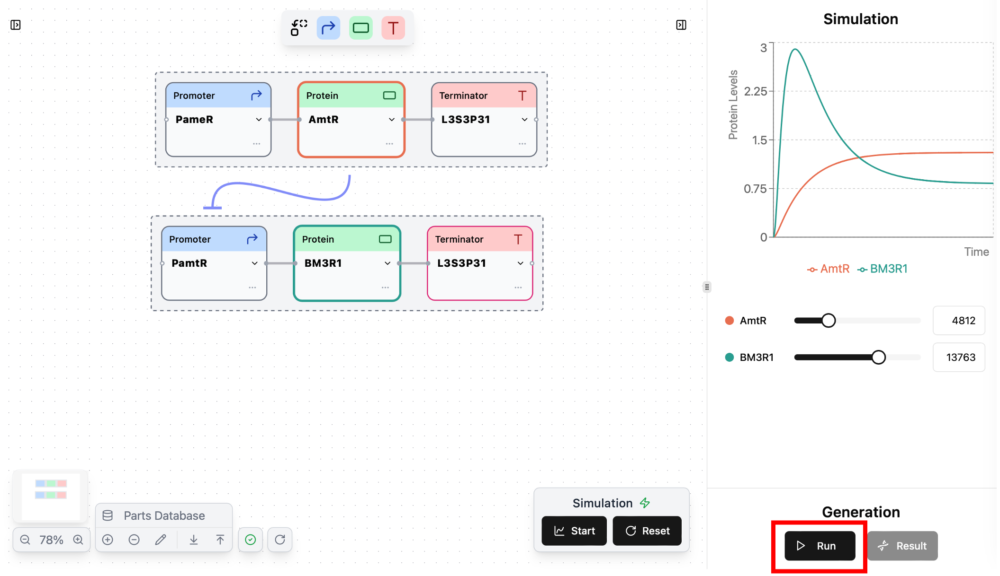
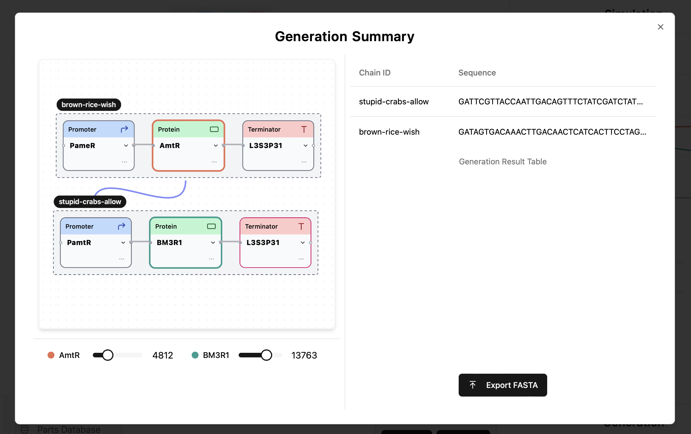
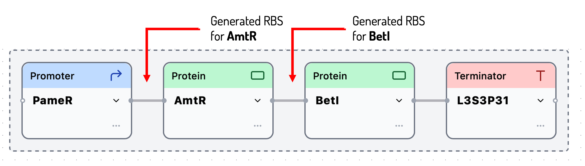

This page provides an explanation of sequence generation.

## Generating sequences

After designing circuit & adjust desired parameters in simulation, you can generate optimized sequence.

To start generation, press the `Run` button in the `Generation` section.



During the generation process, a popup like the below will appear. If you want to stop the generation, you can by pressing the "Cancel" button.

{width="300" height="150"}

!!! Info
	The time required for generation vary depending on the number of chains and the memory status of your Computer.

	(For a detailed explanation of the generation algorithm, please see <u>[this section](#technical-details)</u>.)

## Viewing results

Once the generation is complete, the popup will disappear, and the Result button will become clickable.

When you press the Result button, a window like the below will open.

A chain ID is assigned to each chain and you can see generated sequence for each chain separately.




## Exporting a FASTA file

You can export generated sequences as `FASTA` format file by pressing `Export FASTA` button.

(example.fa)
```FASTA
> stupid-crabs-allow
GATTCGTTACCAATTGACAGTTTCTATCGATCTATAGATAATGCTAGCGGACCCCGCCATCAGCTGCATGAAGTATCAGCCAATTATTGAACACCCTAACGGGTGTTTTTTTTTTTTTGGTCTACC
> brown-rice-wish
GATAGTGACAAACTTGACAACTCATCACTTCCTAGGTATAATGCTAGCTGGCTGCCCTGCGCGTGCAAGCCTCGGGATCCCAATTATTGAACACCCTAACGGGTGTTTTTTTTTTTTTGGTCTACC
```


## Technical details

### Generated sequence

- Synergetica generates `RBS` to realizing the parameters specified in the Simulation section.

- The RBS sequence regulates the translation rate of  downstream protein, so inserted immediately before the protein sequence.



- Sequences shown in the `Generation Summary` contain all nodes and inserted RBS sequence in each chain.

### Generating algorithm

- In Synergetica, sequences are optimize by combining a prediction model with genetic algorithms.

- The prediction model was trained with the dataset of RBS sequence and obserbed TIR value published by <u>[A C. Reis & H M. Salis (2020)](https://pubs.acs.org/doi/10.1021/acssynbio.0c00394)</u>

!!! Info
	For the detailed implementation of training prediction model, see <u>[this repository](https://github.com/khokao/synergetica/tree/main/services#43-ml-model-training-and-evaluation)</u>.


