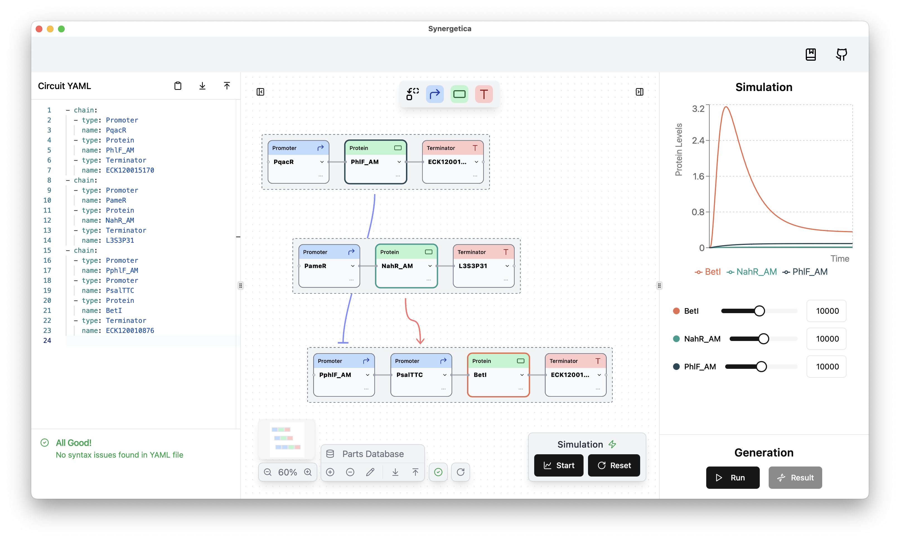

# Introduction

<figure markdown="span">
  { width="80%" }
</figure>

<figure markdown="span">
  
</figure>

## What is Synergetica?

Synergetica is a powerful desktop application for genetic circuit design. It provides an end-to-end workflow that allows you to design circuits, run simulations, and generate DNA sequences—all within a single platform.

## Highlights

* 🧩 Design genetic circuits using either a node-based or code-based interface
* 🤖 Simulate protein expression levels for your circuits interactively
* 🧬 Generate DNA sequences based on parameters determined through simulation
* ⚙️ Customize your circuits by adding genetic parts that suit your needs
